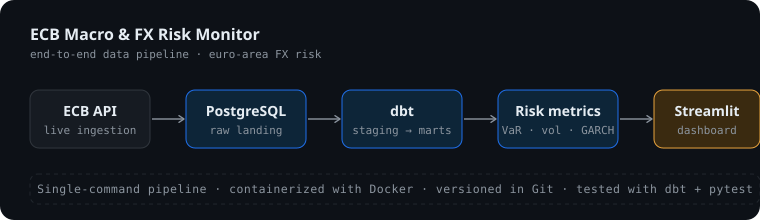
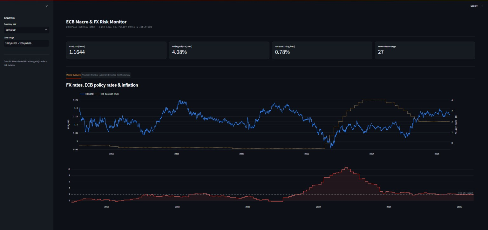
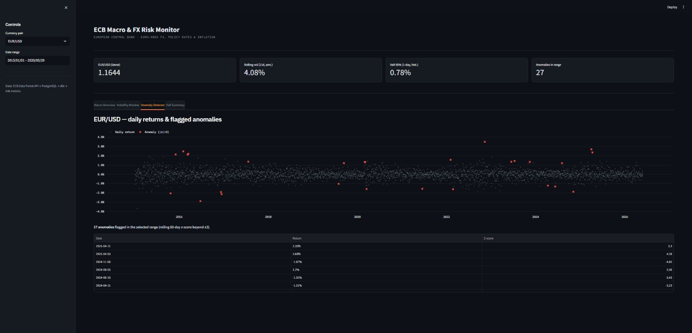
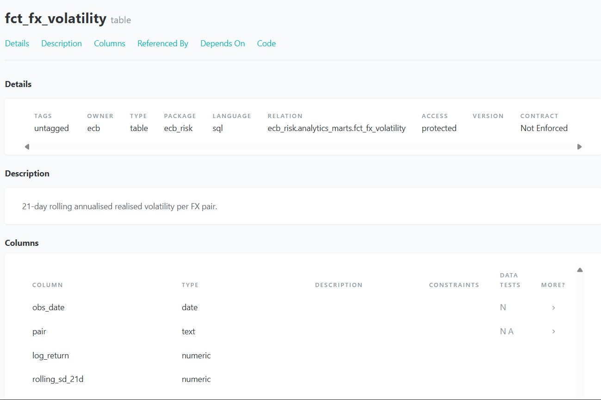

# ECB Macro & FX Risk Monitor

An end-to-end data pipeline that ingests real euro-area economic data from the
**European Central Bank Data Portal API**, models it through a tested **dbt**
transformation layer in **PostgreSQL**, computes recognised **FX risk metrics**
in Python, and surfaces everything in an interactive **Streamlit** dashboard.

> This is a *risk-monitoring* tool — it detects, quantifies, and flags. It is
> deliberately not a forecasting/alpha model: any forward-looking quantity
> (e.g. GARCH conditional volatility) is reported as an estimate, not a market call.



---

## What it does

The pipeline pulls daily euro reference exchange rates (EUR/USD, EUR/GBP,
EUR/JPY, EUR/CHF), the three key ECB policy rates (Main Refinancing, Deposit
Facility, Marginal Lending), and HICP inflation — roughly **24,000 observations
from 2015 to the present** — then:

- lands them idempotently in a PostgreSQL warehouse,
- transforms them through a layered **raw -> staging -> marts** dbt model with
  automated data-quality tests,
- computes per-currency risk measures (rolling volatility, Value-at-Risk,
  z-score anomaly flags, GARCH conditional volatility),
- and presents four analytical views in a dashboard.

## Tech stack

`Python` · `SQL` · `PostgreSQL` · `dbt` · `Docker` · `Streamlit` · `Plotly` ·
`pandas / numpy / scipy / arch` · `Git`

## Dashboard

The monitor has four views — macro overview, volatility, anomaly detection, and
a Value-at-Risk summary.




## Data model (dbt)

Transformations are version-controlled dbt models with sources, staging views,
mart tables, and column-level tests. Full lineage is auto-documented.



**Layers**

| Layer | What lives here |
|-------|-----------------|
| `raw` | `observations` — long, mixed-frequency landing table (one row per series/date) |
| `staging` | typed views: FX (long & wide), policy rates, a business-day calendar, and HICP forward-filled onto that calendar |
| `marts` | `fct_fx_returns`, `fct_fx_volatility`, `fct_macro_snapshot`, plus the Python-built `fct_fx_risk_metrics` and `fct_fx_var_summary` |

A key modelling step reconciles **daily** FX/policy data with **monthly** HICP
inflation by forward-filling inflation onto a business-day calendar, so any join
across the macro series is clean.

## Risk metrics (methodology)

All measures are pure, unit-testable functions over a daily log-return series.

- **Rolling volatility** — 21-day (about one trading month) sample standard
  deviation, annualised by sqrt(252).
- **Value-at-Risk** — both **historical** (empirical quantile, no distributional
  assumption) and **parametric** (normal approximation). Reporting both makes the
  fat-tail tradeoff explicit: the two agree near the 95% level and diverge in the
  99% tail, where the normal model understates real FX risk.
- **Anomaly detection** — rolling 60-day z-score; days beyond +/-3 sigma are
  flagged. Simple and fully explainable (no black box).
- **GARCH(1,1)** — conditional volatility capturing volatility clustering, via
  the `arch` library.

## Quickstart

Requires Docker and Python 3.10+.

```bash
git clone https://github.com/Onkar300/ecb-fx-risk-monitor.git
cd ecb-fx-risk-monitor

cp .env.example .env
python -m venv .venv && source .venv/bin/activate   # Windows: .venv\Scripts\Activate.ps1
pip install -r requirements.txt

docker compose up -d db          # start PostgreSQL

python -m src.ingest             # 1. pull ECB data -> raw

cd dbt                           # 2. build + test the warehouse
export DBT_PROFILES_DIR=.        # Windows: $env:DBT_PROFILES_DIR="."
dbt deps && dbt build
cd ..

python -m src.build_metrics      # 3. compute risk metrics

streamlit run dashboard/app.py   # 4. launch the dashboard
```

## Project structure

```
ecb-fx-risk-monitor/
├── src/
│   ├── ingest.py          # ECB API -> raw (library + REST fallback, idempotent)
│   ├── metrics.py         # pure risk-metric functions
│   ├── build_metrics.py   # writes risk metrics back to the warehouse
│   ├── transform.py       # runs bootstrap SQL
│   ├── quality.py         # data-quality checks
│   └── pipeline.py        # single-command end-to-end run
├── dbt/                   # sources, staging + mart models, tests, docs
├── sql/                   # raw schema bootstrap
├── dashboard/app.py       # Streamlit monitor
├── tests/                 # pytest unit tests for metrics
├── docs/                  # architecture diagram + screenshots
└── docker-compose.yml     # PostgreSQL
```

## Testing

- **dbt tests** — uniqueness, not-null, accepted-values, and composite-key
  checks run on every `dbt build` (29 tests).
- **pytest** — unit tests for the risk-metric functions: `pytest -q`.

## Design notes

- **Idempotent ingestion** — upserts on `(series_id, obs_date)`, so re-running
  never duplicates and always refreshes to the latest values.
- **SQL vs Python split** — set-based transforms (returns, rolling windows,
  joins) live in dbt/SQL; metrics needing specialised libraries (GARCH) live in
  Python. The boundary is deliberate.
- **Resilient API layer** — ingestion tries the `ecbdata` library first and
  falls back to the ECB SDMX REST endpoint automatically.

## Roadmap

- **Airflow** orchestration — scheduled DAG wrapping
  `ingest -> quality -> dbt -> metrics` (current orchestration is a
  single-command pipeline entrypoint).
- **Live deployment** — Streamlit Community Cloud with a hosted Postgres backend.

## Data source

European Central Bank Data Portal (https://data.ecb.europa.eu). Series accessed
via the public SDMX API; this project is for educational/portfolio use.
